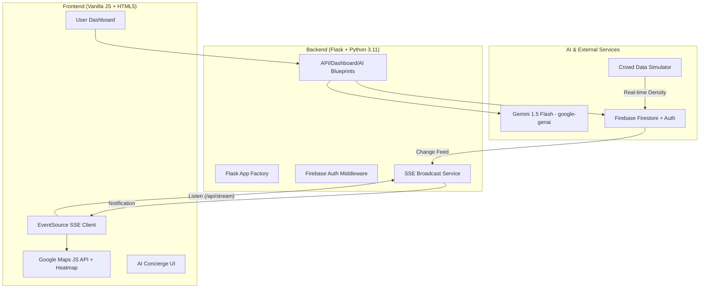

# CrowdPilot Architecture

## System Flow
1.  **Authentication**: Users log in via Firebase. A "Judge Login" bypasses the auth flow for demonstrations.
2.  **Heatmap Updates**: A background simulator logic (or Firestore listeners) updates crowd density. These changes are streamed to the frontend via Server-Sent Events (SSE).
3.  **Real-time Alerts**: The SSE stream allows the backend to push emergency banners instantly to all connected users.
4.  **AI Safety**: The "CrowdPilot Assistant" checks all messages for emergency keywords. If found, it triggers a system bypass to provide immediate safety instructions without AI latency.
5.  **Smart Exit**: Based on stadium congestion, the app dynamically reveals the Exit Planner 15 minutes before the event concludes.
